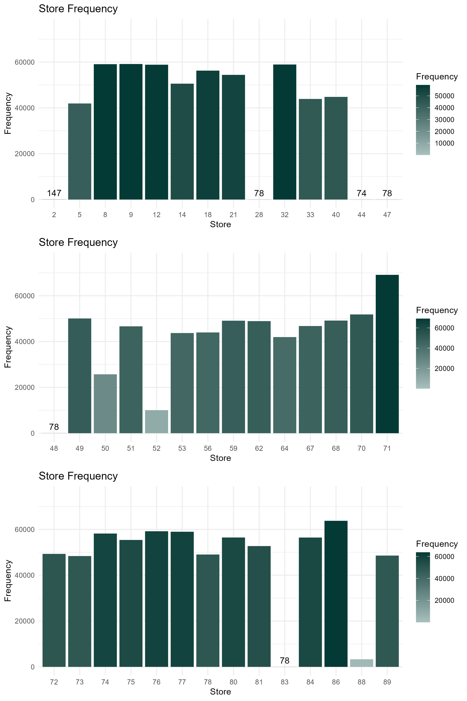
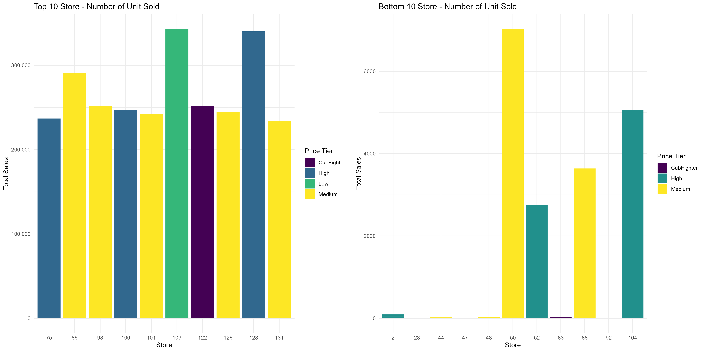
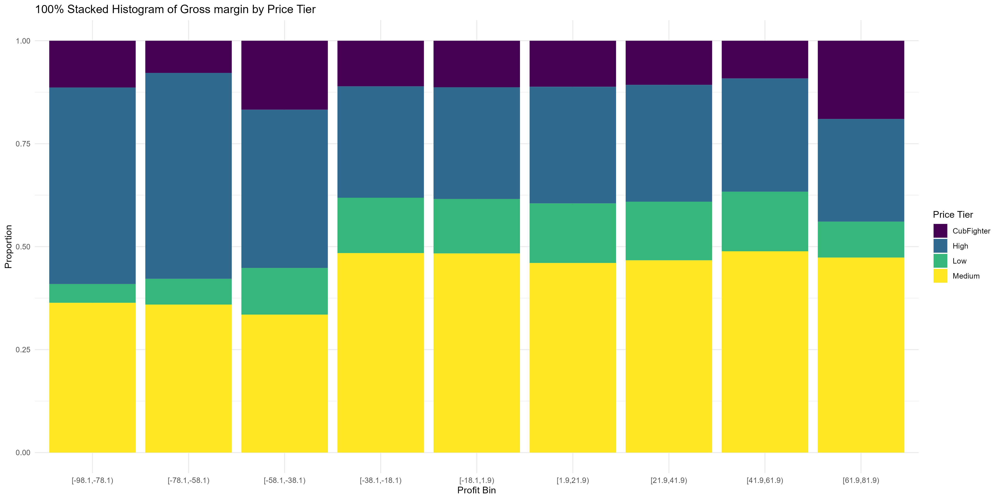
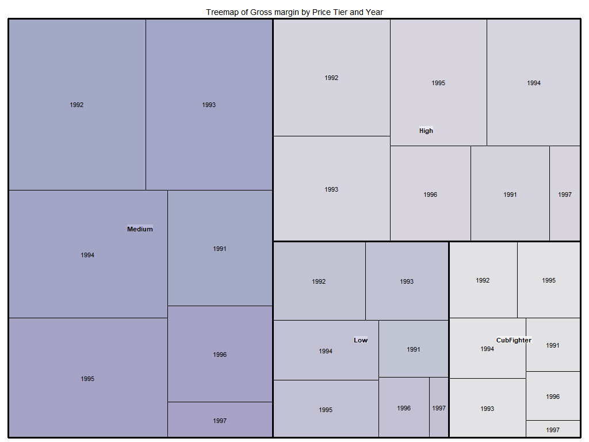
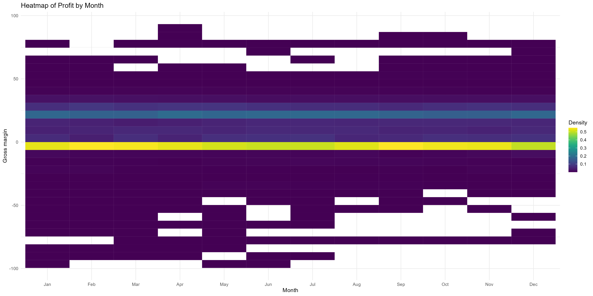

**Student name:**  Huining Huang

**Student ID number:**  110412586


```{r echo = FALSE, include=FALSE}
# clear all variables, functions, etc
# clean up memory
rm(list=ls())
# clean up memory
gc()
```


```{r setup, include=FALSE}
knitr::opts_chunk$set(
  echo = TRUE, 
  fig.width = 8, 
  fig.asp = 0.618, 
  out.width = "80%",
  fig.align = "center", 
  root.dir = "../",
  message = FALSE,
  size = "small"
)
```


```{r warning=FALSE, include=FALSE}
pacman::p_load(tidyverse)
pacman::p_load(knitr,dplyr,AICcmodavg)
pacman::p_load(inspectdf,tidyr,stringr, stringi,DT,mice)

pacman::p_load(mlbench,mplot)
pacman::p_load(tidymodels,glmx)

pacman::p_load(ggplot2,ggpubr,GGally)
knitr::opts_chunk$set(message = FALSE)
```


```{r warning=FALSE, include=FALSE}
# Data manipulation
pacman::p_load(rgl, rattle, mice, dplyr)

# Plotting
pacman::p_load(viridis, hrbrthemes, ggplot2, heplots, forcats)
pacman::p_load(beeswarm, quantmod, reshape2, plyr, scales, viridis, zoo)
pacman::p_load(kableExtra)
```


# Introduction

The Dominick's Finer Foods dataset is a rich collection of store-level scanner data spanning over seven years and approximately 98 million observations. The focus is on utilizing various visualization techniques to harness the scope and potential of Big Data for generating meaningful research questions. The beer data from the Dominick's dataset is used here. The visualizations are categorized into elementary, intermediate, and overall-level question visualizations, each serving unique analytical purposes.

This study integrates various visual variables such as position, size, color value, texture, color hue, orientation, and shape to produce nuanced visual representations. The key aim is to go beyond mere data presentation to facilitate data exploration, inform decision-making, and improve communication. Through these visualizations, we aim to unlock insights into product pricing, profitability, and other performance metrics that can be essential for strategic planning and operational efficiency.


--- 

# Graphic 1

- Store Frequency Across Different Store Segments

- Level of Analysis: Elementary

### Design information
**Type of Graphic:**
Bar Chart

**Invariant:**
The graphic focuses on representing the frequency of stores across different segments. The x-axis consistently shows 'Store IDs', and the y-axis shows 'Frequency'.

**Components:**
Three separate bar plots for different store subsets

**Imposition:**
Vertical layout for the bars, aligned in a single-column, three-row format for easy comparison across store segments.

**Planar Variables:**
X-axis is 'Store', Y-axis is 'Frequency'.

**Retinal Variables:**
Height of bars (Quantitative), Color (Nominal - to differentiate between store IDs within each subset using viridis palette).

**Gestalt Principles:**
Proximity - bars within the same subset plot are closer to each other to imply belonging to the same category.
Similarity - use of a consistent color scale across plots and subsets to denote the same type of data (Frequency).

**Bertin's Schemata:**
The scale and axis remain invariant across the different plots for uniformity and easier cross-comparison.


### Graphic 1

```{r, echo=FALSE, out.width='70%'}
# insert the combined_plot.png here

```


### Questions of interest and conclusion
**Questions:**
1. Which stores have the highest frequency in each segment?
2. Are there stores with particularly low frequencies that require attention?
3. Does the frequency distribution indicate any particular trends across store IDs?
4. Are there stores that are over or underrepresented in the dataset?


**Conclusion:**

The bar chart effectively conveys the frequency distribution of stores across different segments. It highlights which stores have the highest and lowest frequencies within each segment, thereby facilitating targeted business strategies. The design is simplified yet effective, using Gestalt principles for improved cognitive understanding. The visualization can serve as a basis for developing strategies for both high-frequency and low-frequency stores.


---


# Graphic 2

- Top and Bottom 10 Stores by sales

- Level of Analysis: Intermediate-Level


### Design information


**Type of Graphic**:  
Combined Bar Plots

**Invariant**:  
The graphic aims to compare sales performance between the top 10 and bottom 10 stores, segmented by Price Tier. The y-axis represents Total Sales, and the x-axis represents 'STORE'.

**Components**:  
Two separate bar plots juxtaposed horizontally. One plot represents the top 10 stores , and the other represents the bottom 10 stores.

**Imposition**:  
Vertical bars, horizontally juxtaposed layouts for direct top-bottom comparison.

**Planar Variables**:  
X-axis is 'Store', Y-axis is 'MOVE' (Total Sales).

**Retinal Variables**:  
Height of bars (Quantitative - 'MOVE'), Color fill (Nominal - 'Price_Tier').

**Gestalt Principles**:  
Proximity - Bars within the same plot are closer to each other, indicating they belong to the same category (either top 10 or bottom 10 stores).  
Similarity - Use of the same color scale across the top and bottom plots to indicate Price Tier.

**Bertin's Schemata**:  
The scale and axis remain invariant between the two plots for easier comparison.


### Graphic 2

```{r, echo=FALSE, out.width='90%'}
# insert the combined_plot_tb.png here

```

### Questions of interest and conclusion

**Questions**:  

1. Which stores are performing the best and worst in terms of unit sales?
2. How does the Price Tier correlate with total sales for each store?
3. Which Price Tier contributes the most to the sales in top-performing stores?
4. Is there a pattern in Price Tier sales distribution among the bottom-performing stores?
5. Are there any anomalies in the sales patterns of individual stores that warrant further investigation?

**Conclusion**:  
The combined bar plots provide an effective method for comparing the sales performance of the top and bottom 10 stores, segmented by Price Tier. The dual-component design, vertical bar positioning, and side-by-side layout make it easy to draw quick comparisons on how Price Tier related to total sales. The choice of retinal variables enables simultaneous interpretation of sales volume and Price Tier, adding a layer of complexity that is useful for strategic decision-making. 


---


# Graphic 3

- 100% Stacked Histogram of Gross Margin by Price Tier

- Level of Analysis: Intermediate-Level

### Design information


**Type of Graphic**:  
100% Stacked Histogram

**Invariant**:  
The visualization aims to represent the proportion of gross margin (PROFIT) across different Price Tiers. The x-axis encodes binned profit, and the y-axis represents the proportion within each bin for various Price Tiers.

**Components**:  
Single-component, portraying the distribution of gross margin by Price Tier using vertical bars.

**Imposition**:  
Vertical bars, stacked to represent the proportion of each Price Tier within each profit bin.

**Planar Variables**:  
X-axis is 'binned_profit', Y-axis is 'prop' (proportion).

**Retinal Variables**:  
Height of bars (Quantitative - proportion), Color fill (Nominal - Price Tier).

**Gestalt Principles**:  
Proximity - Bars within the same profit bin are stacked together, indicating they belong to the same profit range.  
Similarity - Use of the same color palette across all bins to indicate Price Tier.

**Bertin's Schemata**:  
The scale for proportion remains consistent across the visualization, aiding in easier comparison.


### Graphic 3

```{r, echo=FALSE, out.width='90%'}

```

### Questions of interest and conclusion


**Questions**:  

1. What is the proportion of high-profit products within each Price Tier?
2. Which Price Tier has a higher percentage of low-profit or negative-profit items?
3. Is the distribution of profit similar across different Price Tiers?

**Conclusion**:  

The 100% Stacked Histogram offers an effective representation of how gross margin varies by Price Tier. It employs a straightforward design with vertical bars to communicate both the proportion and the Price Tier of each profit bin. The removal of rows with NA values assures data integrity. Utilizing the Viridis color palette enhances interpretability for those with color vision deficiencies. The visualization can be used to identify Price Tiers with a higher proportion of low-profit items, which can then be further investigated to determine the underlying causes.

---


# Graphic 4

- Treemap of Gross Margin by Price Tier and Year
- Level of Analysis: Overall


### Design information

**Type of Graphic**:  
Treemap

**Invariant**:  
The visualization focuses on displaying the hierarchical and part-to-whole relationships of 'PROFIT' across 'Price_Tier' and 'year'.

**Components**:  
Single-component, illustrating the structure of the 'PROFIT' metric by 'Price_Tier' and nested by 'year'.

**Imposition**:  
Rectangles are spatially positioned and enclosed to represent hierarchy, size, and part-to-whole relationships.

**Planar Variables**:  
Spatial positioning of rectangles (indicating hierarchy and part-to-whole relationships).

**Retinal Variables**:  
Area of rectangles (Quantitative - 'PROFIT'), Color fill (Nominal - 'Price_Tier').

**Gestalt Principles**:  
Enclosure - Rectangles are enclosed within larger rectangles to indicate hierarchy.  
Proximity - Rectangles representing the same 'Price_Tier' or 'year' are positioned close to each other.

**Bertin's Schemata**:  
Consistency in color palette and spatial positioning enhances the ability to quickly grasp hierarchical relationships.


### Graphic 4

```{r, echo=FALSE, out.width='90%'}

```

### Questions of interest and conclusion

**Questions**:  

1. Which 'Price_Tier' consistently has higher 'PROFIT' across years?
2. Is there a year where a particular 'Price_Tier' experienced a significant spike or drop in 'PROFIT'?
3. How does 'PROFIT' distribution within a 'Price_Tier' change over years?

**Conclusion**:  

The treemap effectively visualizes the hierarchical and part-to-whole relationships of 'PROFIT' across 'Price_Tier' and 'year'. By employing spatial positioning and enclosure, it allows for straightforward visual comparisons. The color palette assists in distinguishing between different 'Price_Tiers'. No indications of data integrity issues were noted. The treemap serves as an efficient tool for understanding variations in profit by 'Price_Tier' over multiple years, thereby providing valuable insights for longitudinal profitability analysis.


--- 


# Graphic 5


- Calendar Heat Map: Retail Price by Weekday, Month, and Year
- Level of Analysis: Overall

### Design information


**Type of Graphic**:  
Calendar Heatmap

**Invariant**:  
The heatmap focuses on visualizing time-series data of 'PRICE' across 'year', 'month', and 'weekday'.

**Components**:  
Single-component, where the color intensity of the grid represents the 'PRICE' metric, segmented by 'year', 'month', and 'weekday'.

**Imposition**:  
A grid-based layout structured by time dimensions ('year' and 'month') facilitates time-series analysis.

**Planar Variables**:  
Grid layout segmented by 'year', 'month', and 'weekday'.

**Retinal Variables**:  
Color intensity (Quantitative - 'PRICE').

**Gestalt Principles**:  
Proximity and Continuity - Cells for the same 'year' or 'month' are grouped together, facilitating perception of temporal trends.

**Bertin's Schemata**:  
The planar segmentation allows for an easy comparison and analysis of price fluctuations across time dimensions.

### Graphic 5

```{r, echo=FALSE, out.width='90%'}
knitr::include_graphics("PRICE_week.png")
```


### Questions of Interest and Conclusion

**Questions**:  

1. How does retail 'PRICE' vary within a week for each month and year?
2. Are there any patterns or anomalies in 'PRICE' across weekdays?
3. Is there a noticeable seasonal variation in 'PRICE'?

**Conclusion**:  

The calendar heatmap efficiently visualizes the variation in retail 'PRICE' across 'weekday', 'month', and 'year'. Utilizing a grid layout segmented by these time dimensions, the visualization offers insights into daily, monthly, and yearly pricing trends. The color scheme, although visually impactful, could benefit from a more perceptually uniform palette for better data interpretation. Overall, the heatmap serves as a comprehensive tool for analyzing retail price variations, providing valuable insights into temporal trends and anomalies.


--- 


# Graphic 6

- Heatmap of Profit by Month
- Level of Analysis: Intermediate-Level


### Design Information

**Type of Graphic**:  
Heatmap

**Invariant**:  
This visualization aims to provide an overview of how 'PROFIT' varies across different months ('monthf').

**Components**:  
Single-component heatmap where the x-axis represents 'monthf', the y-axis represents 'PROFIT', and the color density represents the frequency of data points.

**Imposition**:  
The use of geom_bin2d() for binning creates a 2D grid that simplifies complex data into identifiable zones.

**Planar Variables**:  
Grid layout partitioned by 'monthf' (x-axis) and 'PROFIT' (y-axis).

**Retinal Variables**:  
Color density (Quantitative - frequency of data points).

**Gestalt Principles**:  
Similarity and Proximity - Areas of similar color density are grouped together, facilitating the identification of trends or patterns.

**Bertin's Schemata**:  
The grid layout allows for direct comparison across both axes, making it easier to identify correlations between 'PROFIT' and 'monthf'.


### Graphic 6

```{r, echo=FALSE, out.width='90%'}

```

### Questions of Interest and Conclusion

**Questions**:  

1. Which months have the highest density of higher-profit items?
2. Is there any month where low or negative-profit items are more frequent?
3. Are there any significant patterns that can be observed when profits are mapped against months?

**Conclusion**:  

The heatmap offers a synthesized view of the relationship between 'PROFIT' and 'monthf', using color density to indicate frequency. The choice of the Viridis color palette enhances the perception of data point concentration, and the minimalistic theme aids in focusing on the core data. By employing data binning, the visualization simplifies the complexity of the data structure, enabling quick insights into profit trends across months. It serves as a robust tool for identifying monthly patterns in profitability, adding valuable dimensions to business analytics.


## Credicts
- data source: https://www.chicagobooth.edu/research/kilts/research-data/dominicks
- Github-Copliot
- Gpt-4


