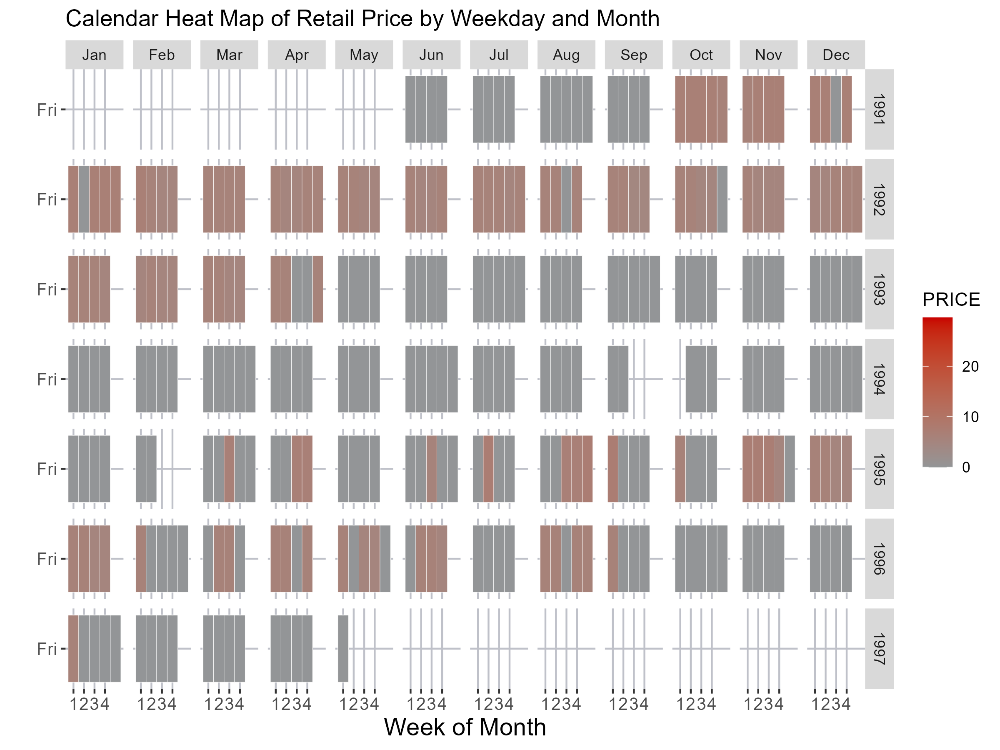

---

**Student name:**  Huining Huang

**Student ID number:**  110412586


\newpage


---


```{r echo = FALSE, include=FALSE}
# clear all variables, functions, etc
# clean up memory
rm(list=ls())
# clean up memory
gc()
```


```{r setup, include=FALSE}
knitr::opts_chunk$set(
  echo = TRUE, 
  fig.width = 8, 
  fig.asp = 0.618, 
  out.width = "80%",
  fig.align = "center", 
  root.dir = "../",
  message = FALSE,
  size = "small"
)
```


```{r warning=FALSE, include=FALSE}
pacman::p_load(tidyverse)
pacman::p_load(knitr,dplyr,AICcmodavg)
pacman::p_load(inspectdf,tidyr,stringr, stringi,DT,mice)
pacman::p_load(caret,modelr)
pacman::p_load(mlbench,mplot)
pacman::p_load(tidymodels,glmx)
pacman::p_load(skimr,vip,yardstick,ranger,kknn,funModeling,Hmisc)
pacman::p_load(ggplot2,ggpubr,GGally)
knitr::opts_chunk$set(message = FALSE)
```


```{r warning=FALSE, include=FALSE}
# Decision tree
pacman::p_load(rpart.plot)

# Data manipulation
pacman::p_load(rgl, rattle, mice, dplyr)

# Plotting
pacman::p_load(viridis, hrbrthemes, ggplot2, heplots, forcats)
pacman::p_load(beeswarm, quantmod, reshape2, plyr, scales, viridis, zoo)
pacman::p_load(kableExtra)
```


## Introduction

The dataset employed in this study originates from Dominick's Finer Foods, a treasure trove of store-level scanner data that encompasses approximately 98 million observations over a seven-year period. The focal point of this analysis is beer, a consumer product with intricate pricing and profitability dynamics. The visualizations are stratified into three levels of analytical depth—elementary, intermediate, and overall—to serve distinct investigative objectives.

The primary motivation for selecting beer as the subject of this study is its widespread consumer appeal and the complexity it adds to retail strategies. The key inquiries guiding this work involve product pricing, profitability and distribution frequencies across various store segments and timeframes.

To ensure data integrity, several preprocessing steps were undertaken. Missing values were eliminated using the `na.omit()` function. Additionally, key variables like 'STORE', 'UPC', and 'OK' were converted to categorical data types. The dataset was then enriched by merging it with an aggregated data file. Date-related transformations were performed using the `lubridate` package, enabling more granular time-series analyses.

This study leverages a gamut of visual variables, including position, size, and color, to create nuanced visual narratives. Beyond mere data presentation, the aim is to facilitate a richer exploration of the dataset, thus contributing to informed decision-making and enhanced business strategies. Through these visualizations, we endeavor to unravel insights into metrics like product pricing and profitability, which are vital for strategic planning and operational efficiency.


```{r warning=FALSE, echo = FALSE, include=FALSE}
beer <- read.csv("data/beer.csv")
beer <- na.omit(beer)
```

```{r warning=FALSE, echo = FALSE, include=FALSE}
# Convert 'store' to a categorical variable
beer$STORE <- as.factor(beer$STORE)
beer$UPC <- as.factor(beer$UPC)
beer$OK <- as.factor(beer$OK)
# drop the column
beer <- beer %>% select(-SALE)
```


```{r warning=FALSE, echo = FALSE, include=FALSE}

beer_agg <- read.csv("Beer_agg.csv")
beer_agg <- na.omit(beer_agg)
head(beer_agg)
# merge the beer data with Beer_agg.csv
beer <- merge(beer, beer_agg, by = c("WEEK", "STORE"))

```


```{r warning=FALSE, echo = FALSE, include=FALSE}

pacman::p_load(lubridate)
# Convert 'Date' to a proper Date object
beer$Date <- lubridate::dmy(beer$Date) # dmy refers to day-month-year format

# Now continue with your transformations
beer <- beer %>%
  mutate(
    year = year(Date),
    month = month(Date),
    monthf = factor(month, levels = 1:12, labels = month.abb, ordered = TRUE)
  ) %>%
  group_by(year, month)

```


--- 


## Graphic 1

- Store Frequency Across Different Store Segments

- Level of Analysis: Elementary


### Design information
**Type of Graphic:**
Bar Chart

**Invariant:**
The graphic focuses on representing the frequency of stores across different segments. The x-axis consistently shows 'Store IDs', and the y-axis shows 'Frequency'.

**Components:**
Three separate bar plots for different store subsets

**Imposition:**
Vertical layout for the bars, aligned in a single-column, three-row format for easy comparison across store segments.

**Planar Variables:**
X-axis is 'Store', Y-axis is 'Frequency'.

**Retinal Variables:**
Height of bars (Quantitative), Color (Nominal - to differentiate between store IDs within each subset using viridis palette).

**Gestalt Principles:**
Proximity - bars within the same subset plot are closer to each other to imply belonging to the same category.
Similarity - use of a consistent color scale across plots and subsets to denote the same type of data (Frequency).

**Bertin's Schemata:**
The scale and axis remain invariant across the different plots for uniformity and easier cross-comparison.


### Graphic 1

```{r warning=FALSE, echo = FALSE}
library(hrbrthemes)
library(viridis)
library(ggpubr)

# Separate the data into three parts
beer1 <- subset(beer, STORE %in% 1:47)
beer2 <- subset(beer, STORE %in% 48:71)
beer3 <- subset(beer, STORE %in% 72:89)

# Determine the y-axis limit
y_limit <- max(table(beer$STORE))

# Plot 1 for Stores 1-39
p1 <- ggplot(beer1, aes(x = STORE)) +
  geom_bar(aes(fill = STORE), position = "dodge") +
  scale_fill_viridis(discrete = TRUE) +
  labs(x = 'Store', y = 'Frequency', fill = 'Store', title = 'Store Frequency') +
  theme_ipsum() +
  theme_minimal() +
  ylim(0, y_limit)

# Plot 2 for Stores 40-69
p2 <- ggplot(beer2, aes(x = STORE)) +
  geom_bar(aes(fill = STORE), position = "dodge") +
  scale_fill_viridis(discrete = TRUE) +
  labs(x = 'Store', y = 'Frequency', fill = 'Store', title = 'Store Frequency') +
  theme_ipsum() +
  theme_minimal() +
  ylim(0, y_limit)

# Plot 3 for Stores 69-89
p3 <- ggplot(beer3, aes(x = STORE)) +
  geom_bar(aes(fill = STORE), position = "dodge") +
  scale_fill_viridis(discrete = TRUE) +
  labs(x = 'Store', y = 'Frequency', fill = 'Store', title = 'Store Frequency') +
  theme_ipsum() +
  theme_minimal() +
  ylim(0, y_limit)
# Determine the y-axis limit
y_limit <- max(table(beer$STORE))

# Function to add labels for low-frequency stores with monochromatic scale
add_low_freq_labels <- function(data, y_limit) {
  p <- ggplot(data, aes(x = STORE, y = ..count..)) +
    geom_bar(aes(fill = ..count..), position = "dodge") +
    geom_text(aes(label = ifelse(..count.. < 300, ..count.., "")), stat = "count", vjust = -0.5) +
    scale_fill_gradient(low = "#a9c0be", high = "#033a35") +
    labs(x = 'Store', y = 'Frequency', fill = 'Frequency', title = 'Store Frequency') +
    theme_ipsum() +
    theme_minimal() +
    ylim(0, y_limit)
  return(p)
}

# Create the plots with conditional labels for low-frequency stores
p1 <- add_low_freq_labels(beer1, y_limit)
p2 <- add_low_freq_labels(beer2, y_limit)
p3 <- add_low_freq_labels(beer3, y_limit)

# Combine p1, p2, p3 into one plot with 1 column and 3 rows
combined_plot <- ggarrange(p1, p2, p3, ncol = 1, nrow = 3)

# Display the combined plot
print(combined_plot)

```


### Questions of interest and conclusion
**Questions:**
1. Which stores have the highest frequency in each segment?
2. Are there stores with particularly low frequencies that require attention?
3. Does the frequency distribution indicate any particular trends across store IDs?
4. Are there stores that are over or underrepresented in the dataset?


**Conclusion:**

The bar charts provide a detailed view of store frequencies across various segments. They identify stores with high frequencies, serving as a key input for allocating resources or running targeted promotions. The charts also flag stores with low frequencies, signaling the need for investigative action. Despite its simplicity, the design leverages Gestalt principles to aid in cognitive processing. However, for enhanced comparative analysis across segments, data labels for low-frequency stores and a unified y-axis could be advantageous.


---


## Graphic 2

- Top and Bottom 10 Stores by sales

- Level of Analysis: Intermediate-Level


### Design information


**Type of Graphic**:  
Combined Bar Plots

**Invariant**:  
The graphic aims to compare sales performance between the top 10 and bottom 10 stores, segmented by Price Tier. The y-axis represents Total Sales, and the x-axis represents 'STORE'.

**Components**:  
Two separate bar plots juxtaposed horizontally. One plot represents the top 10 stores , and the other represents the bottom 10 stores.

**Imposition**:  
Vertical bars, horizontally juxtaposed layouts for direct top-bottom comparison.

**Planar Variables**:  
X-axis is 'Store', Y-axis is 'MOVE' (Total Sales).

**Retinal Variables**:  
Height of bars (Quantitative - 'MOVE'), Color fill (Nominal - 'Price_Tier').

**Gestalt Principles**:  
Proximity - Bars within the same plot are closer to each other, indicating they belong to the same category (either top 10 or bottom 10 stores).  
Similarity - Use of the same color scale across the top and bottom plots to indicate Price Tier.

**Bertin's Schemata**:  
The scale and axis remain invariant between the two plots for easier comparison.


### Graphic 2


```{r warning=FALSE, echo = FALSE, include=FALSE}
# Aggregate data by STORE and Date
agg_store <- aggregate(MOVE ~ Public_holiday + Price_Tier + STORE, data=beer, sum)
# Find the stores with the highest sales
top <- agg_store %>% arrange(desc(MOVE)) %>% head(10)
bottom <- agg_store %>% arrange(MOVE) %>% head(19)
```


```{r warning=FALSE, echo = FALSE}
# Top 10 plot
t <- ggplot(top, aes(x = STORE, y = MOVE, fill = Price_Tier)) +
    geom_bar(stat = "identity") +
    labs(title = "Top 10 Store - Number of Unit Sold", x = 'Store', y = 'Total Sales', fill = 'Price Tier') +
    scale_fill_viridis(discrete = TRUE) +
    scale_y_continuous(labels = scales::comma) +
    theme_minimal()

# Bottom 10 plot
b <- ggplot(bottom, aes(x = STORE, y = MOVE, fill = Price_Tier)) +
    geom_bar(stat = "identity") +
    labs(title = "Bottom 10 Store - Number of Unit Sold", x = 'Store', y = 'Total Sales', fill = 'Price Tier') +
    scale_fill_viridis(discrete = TRUE) +
    ylim(0, max(bottom$MOVE)) +
    theme_minimal()

# Adding annotations to indicate different scales
t <- t + annotate("text", x = Inf, y = Inf, label = "Scale 1", vjust = 1, hjust = 1)
b <- b + annotate("text", x = Inf, y = Inf, label = "Scale 2", vjust = 1, hjust = 1)


# Combine both plots
tb <- ggarrange(t, b, ncol = 2, nrow = 1)

# Display the combined plot
print(tb)
```


### Questions of interest and conclusion

**Questions**:  

1. Which stores are performing the best and worst in terms of unit sales?
2. How does the Price Tier correlate with total sales for each store?
3. Which Price Tier contributes the most to the sales in top-performing stores?
4. Is there a pattern in Price Tier sales distribution among the bottom-performing stores?
5. Are there any anomalies in the sales patterns of individual stores that warrant further investigation?

**Conclusion**: 
The combined bar plots adeptly facilitate the comparison of sales performance between the top 10 and bottom 10 stores, segmented by Price Tier. The layout and choice of retinal variables enable complex yet straightforward analyses. However, the graphic could be enhanced by standardizing the y-axis or explicitly noting the differing scales. This additional layer would mitigate potential misinterpretations, thereby making the visualization more robust for strategic decisions.


---


## Graphic 3

- 100% Stacked Histogram of Gross Margin by Price Tier

- Level of Analysis: Intermediate-Level

### Design information

**Type of Graphic**:  
100% Stacked Histogram

**Invariant**:  
The visualization aims to represent the proportion of gross margin (PROFIT) across different Price Tiers. The x-axis encodes binned profit, and the y-axis represents the proportion within each bin for various Price Tiers.

**Components**:  
Single-component, portraying the distribution of gross margin by Price Tier using vertical bars. The data binning is used to simplify the complexity of the data structure but the data requires further cleaning and organization.

**Imposition**:  
Vertical bars, stacked to represent the proportion of each Price Tier within each profit bin. The x-axis labels could benefit from better formatting or a larger font size for easier reading.

**Planar Variables**:  
X-axis is 'binned_profit', Y-axis is 'prop' (proportion).

**Retinal Variables**:  
Height of bars (Quantitative - proportion), Color fill (Nominal - Price Tier).

**Gestalt Principles**:  
Proximity - Bars within the same profit bin are stacked together, indicating they belong to the same profit range.  
Similarity - Use of the same color palette across all bins to indicate Price Tier.

**Bertin's Schemata**:  
The scale for proportion remains consistent across the visualization, aiding in easier comparison.


### Graphic 3


```{r warning=FALSE, echo = FALSE}
# Ungroup the data frame
beer <- ungroup(beer)

# Step 1: Calculate bin counts
bins <- seq(min(beer$PROFIT, na.rm = TRUE), max(beer$PROFIT, na.rm = TRUE), by = 20)

# Create binned data
binned_data <- beer %>%
  mutate(binned_profit = cut(PROFIT, breaks = bins, right = FALSE)) %>%
  group_by(binned_profit, Price_Tier) %>%
  tally(name = "count")

# Step 2: Calculate proportions
binned_data <- binned_data %>%
  group_by(binned_profit) %>%
  mutate(prop = count / sum(count))

# Remove all the rows with NA
binned_data <- binned_data[complete.cases(binned_data), ]

# Step 3: Plot with consistent styling
ggplot(binned_data, aes(x = binned_profit, y = prop, fill = Price_Tier)) +
  geom_bar(stat = "identity", position = "fill") +
  labs(title = "100% Stacked Histogram of Gross margin by Price Tier", x = "Profit Bin", y = "Proportion", fill = "Price Tier") +
  scale_fill_viridis(discrete = TRUE) +
  theme_minimal() +
  scale_x_discrete(labels = function(x) stringr::str_wrap(x, 10)) +
  theme(axis.text.x = element_text(angle = 45, hjust = 1))

```

### Questions of interest and conclusion


**Questions**:  

1. What is the proportion of high-profit products within each Price Tier?
2. Which Price Tier has a higher percentage of low-profit or negative-profit items?
3. Is the distribution of profit similar across different Price Tiers?

**Conclusion**:  

The 100% Stacked Histogram effectively portrays the distribution of gross margin across various Price Tiers. The vertical bars and color palettes are chosen to represent both proportion and Price Tier, enhancing interpretability even for those with color vision deficiencies. While the graphic is an effective tool for identifying Price Tiers requiring further investigation, enhancements in readability and potential interactive features could make it even more user-friendly and informative.


---


## Graphic 4

- Treemap of Gross Margin by Price Tier and Year
- Level of Analysis: Overall


### Design information

**Type of Graphic**:  
Treemap

**Invariant**:  
The visualization focuses on displaying the hierarchical and part-to-whole relationships of 'PROFIT' across 'Price_Tier' and 'year'. 

**Components**:  
Single-component, illustrating the structure of the 'PROFIT' metric by 'Price_Tier' and nested by 'year'. 

**Imposition**:  
Rectangles are spatially positioned and enclosed to represent hierarchy, size, and part-to-whole relationships. It employs a well-selected color palette and spatial positioning to guide the eye through the data.

**Planar Variables**:  
Spatial positioning of rectangles (indicating hierarchy and part-to-whole relationships).

**Retinal Variables**:  
Area of rectangles (Quantitative - 'PROFIT'), Color fill (Nominal - 'Price_Tier').

**Gestalt Principles**:  
Enclosure - Rectangles are enclosed within larger rectangles to indicate hierarchy.  
Proximity - Rectangles representing the same 'Price_Tier' or 'year' are positioned close to each other.

**Bertin's Schemata**:  
Consistency in color palette and spatial positioning enhances the ability to quickly grasp hierarchical relationships.


### Graphic 4

```{r warning=FALSE, echo = FALSE}
# Install and load the treemap package
pacman::p_load(treemap)


# Create a Treemap with improved design
treemap(
  beer,
  index = c("Price_Tier", "year"), 
  vSize = "PROFIT",
  vColor = "Price_Tier",
  palette="Purples", 
  algorithm = "pivotSize",
  title = "Treemap of Gross margin by Price Tier and Year"
)

```

### Questions of interest and conclusion

**Questions**:  

1. Which 'Price_Tier' consistently has higher 'PROFIT' across years?
2. Is there a year where a particular 'Price_Tier' experienced a significant spike or drop in 'PROFIT'?
3. How does 'PROFIT' distribution within a 'Price_Tier' change over years?

**Conclusion**:  

The treemap excels in visualizing the complex hierarchical and part-to-whole relationships of 'PROFIT' across 'Price_Tier' and 'year'. The use of spatial positioning and color differentiation aids in quick visual comprehension. While the design is efficient in conveying longitudinal profitability trends, the addition of in-rectangle labels could provide even more immediate clarity. No data integrity issues were observed, making this a reliable tool for longitudinal profitability analysis.


--- 


## Graphic 5


- Calendar Heat Map: Retail Price by Weekday, Month, and Year
- Level of Analysis: Overall

### Design information


**Type of Graphic**:  
Calendar Heatmap

**Invariant**:  
The heatmap focuses on visualizing time-series data of 'PRICE' across 'year', 'month', and 'weekday'.

**Components**:  
Single-component, where the color intensity of the grid represents the 'PRICE' metric, segmented by 'year', 'month', and 'weekday'.

**Imposition**:  
A grid-based layout structured by time dimensions ('year' and 'month') facilitates time-series analysis.

**Planar Variables**:  
Grid layout segmented by 'year', 'month', and 'weekday'.

**Retinal Variables**:  
Color intensity (Quantitative - 'PRICE').

**Gestalt Principles**:  
Proximity and Continuity - Cells for the same 'year' or 'month' are grouped together, facilitating perception of temporal trends.

**Bertin's Schemata**:  
The planar segmentation allows for an easy comparison and analysis of price fluctuations across time dimensions.

### Graphic 5


```{r warning=FALSE, echo = FALSE}
# display the calendar heatmap PRICE_week.png

```


### Questions of Interest and Conclusion

**Questions**:  

1. How does retail 'PRICE' vary within a week for each month and year?
2. Are there any patterns or anomalies in 'PRICE' across weekdays?
3. Is there a noticeable seasonal variation in 'PRICE'?

**Conclusion**:  

The calendar heatmap is a robust tool for exploring retail 'PRICE' variations across multiple time dimensions, offering insights into daily, monthly, and yearly trends. The grid layout, segmented by 'year', 'month', and 'weekday', is well-implemented. However, the visualization could gain in interpretability by employing a more perceptually uniform color palette and by adding labels for months and weekdays. In its current form, the heatmap already serves as a valuable asset for detecting temporal price trends and anomalies.

--- 


## Graphic 6

- Heatmap of Profit by Month
  
- Level of Analysis: Intermediate-Level


### Design Information

**Type of Graphic**:  
Heatmap

**Invariant**:  
The heatmap is an effective tool for identifying the relationship between 'PROFIT' and 'monthf'. It uses color density as a metric for frequency, simplifying complex data for quick interpretation.

**Components**:  
Single-component heatmap where the x-axis represents 'monthf', the y-axis represents 'PROFIT', and the color density represents the frequency of data points.

**Imposition**:  
The use of geom_bin2d() for binning creates a 2D grid that simplifies complex data into identifiable zones.

**Planar Variables**:  
Grid layout partitioned by 'monthf' (x-axis) and 'PROFIT' (y-axis).

**Retinal Variables**:  
Color density (Quantitative - frequency of data points).

**Gestalt Principles**:  
Similarity and Proximity - Areas of similar color density are grouped together, facilitating the identification of trends or patterns.

**Bertin's Schemata**:  
The grid layout allows for direct comparison across both axes, making it easier to identify correlations between 'PROFIT' and 'monthf'.


### Graphic 6

```{r warning=FALSE, echo = FALSE}
ggplot(beer, aes(x = monthf, y = PROFIT)) +
  geom_bin2d(aes(fill = ..density..), bins = 30) +
  scale_fill_viridis() +
  labs(x = 'Month', y = 'Gross margin', fill = 'Density', title = 'Heatmap of Profit by Month') +
  theme_ipsum() +
  theme_minimal()

```

### Questions of Interest and Conclusion

**Questions**:  

1. Which months have the highest density of higher-profit items?
2. Is there any month where low or negative-profit items are more frequent?
3. Are there any significant patterns that can be observed when profits are mapped against months?

**Conclusion**:  

The heatmap provides a compact yet insightful view of how 'PROFIT' varies across different months. Employing a Viridis color palette and data binning, it transforms complex data into easily interpretable patterns. However, the addition of a color legend and more granular axis labels could further enhance the visualization's utility. Despite these minor points for improvement, the heatmap remains a powerful tool for scrutinizing monthly trends in profitability, contributing valuable perspectives to business analytics.

---


## References
Chiera , BA & Korolkiewicz, MW 2017, 'Visualizing Big Data: Everything Old is New Again', in FPG Marquez & B Lev (eds), Big Data Management, Springer, Netherlands, Ch. 1, pp. 1-27.

## Credicts
- data source: https://www.chicagobooth.edu/research/kilts/research-data/dominicks
- Github-Copliot
- Gpt-4
- R code written by Belinda Chiera
- Grammarly
- vscode-R-extension


