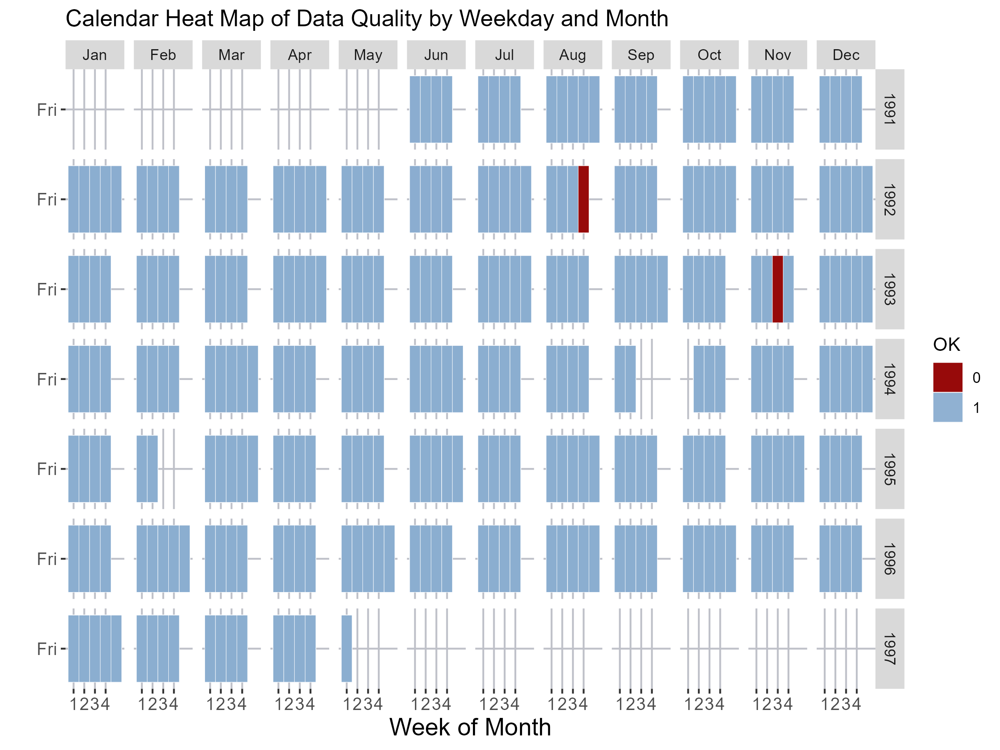

```{r echo = FALSE, include=FALSE}
# clear all variables, functions, etc
# clean up memory
rm(list=ls())
# clean up memory
gc()
```


```{r setup, include=FALSE}
knitr::opts_chunk$set(
  echo = TRUE, 
  fig.width = 8, 
  fig.asp = 0.618, 
  out.width = "80%",
  fig.align = "center", 
  root.dir = "../",
  message = FALSE,
  size = "small"
)
```


```{r warning=FALSE, include=FALSE}
pacman::p_load(tidyverse)
pacman::p_load(knitr,dplyr,AICcmodavg)
pacman::p_load(inspectdf,tidyr,stringr, stringi,DT,mice)
pacman::p_load(caret,modelr)
pacman::p_load(mlbench,mplot)
pacman::p_load(tidymodels,glmx)
pacman::p_load(skimr,vip,yardstick,ranger,kknn,funModeling,Hmisc)
pacman::p_load(ggplot2,ggpubr,GGally)
knitr::opts_chunk$set(message = FALSE)
```


```{r warning=FALSE, include=FALSE}
# Decision tree
pacman::p_load(rpart.plot)

# Data manipulation
pacman::p_load(rgl, rattle, mice, dplyr)

# Plotting
pacman::p_load(viridis, hrbrthemes, ggplot2, heplots, forcats)
pacman::p_load(beeswarm, quantmod, reshape2, plyr, scales, viridis, zoo)
pacman::p_load(kableExtra)
```


```{r warning=FALSE, echo = FALSE, include=FALSE}
beer <- read.csv("data/beer.csv")
beer <- na.omit(beer)
```

```{r warning=FALSE, echo = FALSE, include=FALSE}
str(beer)
# check the shape of the data
dim(beer)
```


# Define the variable description data
variable_data <- data.frame(
  Variable = c("upc", "store", "week", "move", "price", "qty", "profit", "sale", "ok"),
  Description = c("UPC Number", "Store Number", "Week Number", "Number of unit sold", "Retail Price",
                  "Number of item bundled together", "Gross margin", "Sale code (B,C,S)", "1 for valid data, 0 for trash"),
  Type = c("Numeric", "Numeric", "Numeric", "Numeric", "Numeric", "Numeric", "Numeric", "Character", "Numeric"),
  Length = c("8", "3", "3", "8", "8", "3", "8", "8", "3")
)

# Create a kable table
kable(variable_data, format = "html", 
      caption = "Variable Description Table", 
      col.names = c("Variable", "Description", "Type", "Length")) %>%
  kable_styling(bootstrap_options = "striped", full_width = FALSE)


Add a new column to the beer dataset called "week_start_date" and "week_end_date" that contains the start and end dates for each week. This will allow us to easily filter the data by week in the future and do some time series analysis. I will use the lubridate package to do this. I will also convert the "Date" column to a date format.


Change the data type of the "store" column from numeric to character. Treating the "store" column as a categorical or factor variable might align better with the characteristics of store numbers, especially if they are identifiers without meaningful numerical relationships. 'UPC' is key to merge upc file, so I will convert it to a factor variable.


```{r warning=FALSE}
# Convert 'store' to a categorical variable
beer$STORE <- as.factor(beer$STORE)
beer$UPC <- as.factor(beer$UPC)
beer$OK <- as.factor(beer$OK)
# drop the column
beer <- beer %>% select(-SALE)
```


The "Sales" column indicates product promotions using codes 'B' (Bonus Buy), 'C' (Coupon), and 'S' (price reduction). However, the data's inconsistency in setting this column introduces uncertainty. A set value indicates a promotion, but its absence doesn't reliably imply no promotion. Due to this unreliability, I am excluding the "Sales" column from analysis to ensure accurate and trustworthy results.

```{r warning=FALSE}
# Use the skim() function to perform EDA on the 'beer' dataset
skim_results <- skim(beer)
# Print the summary of EDA results
print(skim_results)
```

The skim function provides a summary of the data, including the number of observations, number of variables, number of numeric and character variables, and the number of variables with missing values. It also provides a summary of each variable, including the variable name, type, number of missing values, number of unique values, and the top 5 values. The summary also includes the minimum, maximum, mean, median, and standard deviation for numeric variables. The summary also includes the number of zeros, positive values, and negative values for numeric variables. The summary also includes the number of empty, whitespace, and complete values for character variables. The summary also includes the first and last 5 values for character variables.

```{r warning=FALSE}

beer_agg <- read.csv("Beer_agg.csv")
beer_agg <- na.omit(beer_agg)
head(beer_agg)
# merge the beer data with Beer_agg.csv
beer <- merge(beer, beer_agg, by = c("WEEK", "STORE"))
head(beer)
```


```{r warning=FALSE}

pacman::p_load(lubridate)
# Convert 'Date' to a proper Date object
beer$Date <- lubridate::dmy(beer$Date) # dmy refers to day-month-year format

# Now continue with your transformations
beer <- beer %>%
  mutate(
    year = year(Date),
    month = month(Date),
    monthf = factor(month, levels = 1:12, labels = month.abb, ordered = TRUE)
  ) %>%
  group_by(year, month)

```


```{r warning=FALSE}
# check how many unique values are in each column
sapply(beer, function(x) length(unique(x)))

head(beer)
```


# Plot using PRICE as the fill variable
PRICE_week <- ggplot(beer, aes(x = monthweek, y = weekdayf, fill = PRICE)) +
  geom_tile(color = "white") +
  facet_grid(year ~ monthf) +
  scale_fill_gradient(low = "#939597", high = "#c80000") +
  theme(
    panel.background = element_rect(fill = "white"),
    panel.grid.major = element_line(color = "#BFC1C9"),
    axis.title = element_text(size = 14),
    axis.text = element_text(size = 10)
  ) +
  scale_x_continuous(breaks = 1:4) + 
  xlab("Week of Month") +
  ylab("") +
  ggtitle("Calendar Heat Map of Retail Price by Weekday and Month")  # Add title here

# Save the plot to a PNG file
# ggsave("PRICE_week.png", plot = PRICE_week, width = 8, height = 6)


# Plot
notOK_week <- ggplot(beer, aes(x = monthweek, y = weekdayf, fill = OK)) +
  geom_tile(color = "white") +
  facet_grid(year ~ monthf) +
  scale_fill_manual(values = c("1" = "#8baed0f1", "0" = "#970a0a")) +
  theme(
    panel.background = element_rect(fill = "white"),
    panel.grid.major = element_line(color = "#BFC1C9"),
    axis.title = element_text(size = 14),
    axis.text = element_text(size = 10)
  ) +
  scale_x_continuous(breaks = 1:4) +
  xlab("Week of Month") +
  ylab("") +
  ggtitle("Calendar Heat Map of Data Quality by Weekday and Month") 


# Save the plot to a PNG file
# ggsave("notOK_week.png", plot = notOK_week, width = 8, height = 6)





# Elementary-Level Graphic:


Design Principles:

Simplicity: Show only time on the X-axis and sales on the Y-axis.
Annotation: Label significant points like sales spikes.


Bar Plot for Store Frequency: Provides an overview of the number of entries per store.


```{r warning=FALSE}
library(hrbrthemes)
library(viridis)
library(ggpubr)

# Separate the data into three parts
beer1 <- subset(beer, STORE %in% 1:47)
beer2 <- subset(beer, STORE %in% 48:71)
beer3 <- subset(beer, STORE %in% 72:89)

# Determine the y-axis limit
y_limit <- max(table(beer$STORE))

# Plot 1 for Stores 1-39
p1 <- ggplot(beer1, aes(x = STORE)) +
  geom_bar(aes(fill = STORE), position = "dodge") +
  scale_fill_viridis(discrete = TRUE) +
  labs(x = 'Store', y = 'Frequency', fill = 'Store', title = 'Store Frequency') +
  theme_ipsum() +
  theme_minimal() +
  ylim(0, y_limit)

# Plot 2 for Stores 40-69
p2 <- ggplot(beer2, aes(x = STORE)) +
  geom_bar(aes(fill = STORE), position = "dodge") +
  scale_fill_viridis(discrete = TRUE) +
  labs(x = 'Store', y = 'Frequency', fill = 'Store', title = 'Store Frequency') +
  theme_ipsum() +
  theme_minimal() +
  ylim(0, y_limit)

# Plot 3 for Stores 69-89
p3 <- ggplot(beer3, aes(x = STORE)) +
  geom_bar(aes(fill = STORE), position = "dodge") +
  scale_fill_viridis(discrete = TRUE) +
  labs(x = 'Store', y = 'Frequency', fill = 'Store', title = 'Store Frequency') +
  theme_ipsum() +
  theme_minimal() +
  ylim(0, y_limit)
# Determine the y-axis limit
y_limit <- max(table(beer$STORE))

# Function to add labels for low-frequency stores with monochromatic scale
add_low_freq_labels <- function(data, y_limit) {
  p <- ggplot(data, aes(x = STORE, y = ..count..)) +
    geom_bar(aes(fill = ..count..), position = "dodge") +
    geom_text(aes(label = ifelse(..count.. < 300, ..count.., "")), stat = "count", vjust = -0.5) +
    scale_fill_gradient(low = "#a9c0be", high = "#033a35") +
    labs(x = 'Store', y = 'Frequency', fill = 'Frequency', title = 'Store Frequency') +
    theme_ipsum() +
    theme_minimal() +
    ylim(0, y_limit)
  return(p)
}

# Create the plots with conditional labels for low-frequency stores
p1 <- add_low_freq_labels(beer1, y_limit)
p2 <- add_low_freq_labels(beer2, y_limit)
p3 <- add_low_freq_labels(beer3, y_limit)

# Combine p1, p2, p3 into one plot with 1 column and 3 rows
combined_plot <- ggarrange(p1, p2, p3, ncol = 1, nrow = 3)

# Display the combined plot
print(combined_plot)
# Save the combined plot to a PNG file
# ggsave("combined_plot.png", plot = combined_plot, width = 8, height = 12)
```

```{r warning=FALSE, include=FALSE}
head(beer)
```


```{r warning=FALSE}
# Aggregate data by STORE and Date
agg_store <- aggregate(MOVE ~ Public_holiday + Price_Tier + STORE, data=beer, sum)
head(agg_store)

```


```{r warning=FALSE}
ggplot(agg_store, aes(x = Price_Tier, y = MOVE, fill = Public_holiday)) +
    geom_bar(stat = "identity") +
    labs(x = 'Store', y = 'Total Sales', fill = 'Price Tier') +
    theme_minimal()

```

```{r warning=FALSE}
ggplot(agg_store, aes(x = Price_Tier, y = MOVE)) +
    geom_boxplot() +
    labs(x = 'Price Tier', y = 'Total Sales') +
    theme_minimal()
```


```{r warning=FALSE}
# Find the stores with the highest sales
top <- agg_store %>% arrange(desc(MOVE)) %>% head(10)
bottom <- agg_store %>% arrange(MOVE) %>% head(19)
top
bottom
```

```{r warning=FALSE}
# Top 10 plot
t <- ggplot(top, aes(x = STORE, y = MOVE, fill = Price_Tier)) +
    geom_bar(stat = "identity") +
    labs(title = "Top 10 Store - Number of Unit Sold", x = 'Store', y = 'Total Sales', fill = 'Price Tier') +
    scale_fill_viridis(discrete = TRUE) +
    scale_y_continuous(labels = scales::comma) +
    theme_minimal()

# Bottom 10 plot
b <- ggplot(bottom, aes(x = STORE, y = MOVE, fill = Price_Tier)) +
    geom_bar(stat = "identity") +
    labs(title = "Bottom 10 Store - Number of Unit Sold", x = 'Store', y = 'Total Sales', fill = 'Price Tier') +
    scale_fill_viridis(discrete = TRUE) +
    ylim(0, max(bottom$MOVE)) +
    theme_minimal()

# Adding annotations to indicate different scales
t <- t + annotate("text", x = Inf, y = Inf, label = "Scale 1", vjust = 1, hjust = 1)
b <- b + annotate("text", x = Inf, y = Inf, label = "Scale 2", vjust = 1, hjust = 1)

# Combining the plots
tb <- ggarrange(t, b, ncol = 2, nrow = 1)

# Displaying the combined plot
print(tb)


```


```{r warning=FALSE}
count_values_equal_0 <- sum(beer$MOVE == 0)
print(count_values_equal_0)
count_values_below_100 <- sum(beer$MOVE < 100)
print(count_values_below_100)
count_values_above_100 <- sum(beer$MOVE > 100)
print(count_values_above_100)
count_values_above_200 <- sum(beer$MOVE > 200)
print(count_values_above_200)
```

```{r warning=FALSE}
head(beer)
```


ggplot(beer, aes(x = Date, y = MOVE)) +
  geom_line(aes(color = Price_Tier)) +
  scale_fill_viridis(discrete = TRUE) +
  facet_grid(~ Price_Tier) +
  labs(title = "Faceted Time Series Plot for 'MOVE' by Price_Tier", x = "Date", y = "Unit Sold (MOVE)") +
  theme_ipsum() +
  theme_minimal()


```{r warning=FALSE}
# Ungroup the data frame
beer <- ungroup(beer)

# Step 1: Calculate bin counts
bins <- seq(min(beer$PROFIT, na.rm = TRUE), max(beer$PROFIT, na.rm = TRUE), by = 20)

# Create binned data
binned_data <- beer %>%
  mutate(binned_profit = cut(PROFIT, breaks = bins, right = FALSE)) %>%
  group_by(binned_profit, Price_Tier) %>%
  tally(name = "count")

# Step 2: Calculate proportions
binned_data <- binned_data %>%
  group_by(binned_profit) %>%
  mutate(prop = count / sum(count))
```

```{r warning=FALSE}
# remove all the rows with NA
binned_data <- binned_data[complete.cases(binned_data), ]
head(binned_data)
```

```{r warning=FALSE}
# Step 3: Plot with consistent styling
ggplot(binned_data, aes(x = binned_profit, y = prop, fill = Price_Tier)) +
  geom_bar(stat = "identity", position = "fill") +
  labs(title = "100% Stacked Histogram of Gross margin by Price Tier", x = "Profit Bin", y = "Proportion", fill = "Price Tier") +
  scale_fill_viridis(discrete = TRUE) +
  theme_minimal()

# Save the plot as a PNG
# ggsave("100_percent_stacked_histogram.png", width = 16, height = 8)

```


Boxplot of Profit by Month: Shows the central tendency and spread of profit across different months.


# Boxplot of Profit by Month
ggplot(beer, aes(x = monthf, y = PROFIT)) +
  geom_boxplot(aes(fill = monthf)) +
  scale_fill_viridis(discrete = TRUE) +
  labs(x = 'Month', y = 'Profit', fill = 'Month', title = 'Boxplot of Profit by Month') +
  theme_ipsum() +
  theme_minimal()


```{r warning=FALSE}
ggplot(beer, aes(x = monthf, y = PROFIT)) +
  geom_bin2d(aes(fill = ..density..), bins = 30) +
  scale_fill_viridis() +
  labs(x = 'Month', y = 'Gross margin', fill = 'Density', title = 'Heatmap of Profit by Month') +
  theme_ipsum() +
  theme_minimal()

# save the plot as a PNG
# ggsave("heatmap_profit_month.png", width = 16, height = 8)
```


```{r warning=FALSE}
# Install and load the treemap package
pacman::p_load(treemap)

# Create a Treemap with customizations
treemap(beer,
        index = c("Price_Tier", "monthf"),
        vSize = "PROFIT",
        vColor = "Price_Tier",
        draw = TRUE,
        title = "Treemap of Profit by Price Tier and Month")

```

```{r warning=FALSE}
head(beer)
```

```{r warning=FALSE}
# Install and load the treemap package
pacman::p_load(treemap)

# png("treemap_plot.png", width = 1024, height = 768)

# Create a Treemap with improved design
treemap(
  beer,
  index = c("Price_Tier", "year"), 
  vSize = "PROFIT",
  vColor = "Price_Tier",
  palette="Purples", 
  algorithm = "pivotSize",
  title = "Treemap of Gross margin by Price Tier and Year"
)

# save the plot as a PNG
# dev.off()
```


```{r warning=FALSE}
ggplot(beer, aes(x = year, y = PROFIT, fill = Price_Tier)) +
  geom_boxplot() +
  labs(title = "Yearly Profit Distribution by Price Tier") +
  theme_minimal()
```

```{r warning=FALSE}
ggplot(beer, aes(x = STORE, y = year, fill = PROFIT)) +
  geom_tile() +
  labs(title = "Heatmap of Profit by Store and Year") +
  theme_minimal()
```


Questions Answered:

When are the sales peaks?
Is there a seasonality?

# Intermediate-Level Graphic: Boxplot by Store

Design Principles:

Complexity: Multiple boxplots for each store to indicate distribution.
Color Coding: Different colors for different stores.

```{r warning=FALSE}
ggplot(beer, aes(x = STORE, y = MOVE, color = STORE)) +
  geom_boxplot() +
  ggtitle("Distribution of Sales by Store") +
  xlab("Store") +
  ylab("Units Sold")
```

Questions Answered:

Which stores have a wider variability in sales?
Which stores have the highest median sales?

# Overall Graphic: Faceted Plot of Sales by Week and Store

Design Principles:
Multifaceted: Divide the plot by weeks and stores.
Aesthetics: Use a clean theme and color palette.

```{r warning=FALSE}
ggplot(beer, aes(x = week_start_date, y = MOVE, color = STORE)) +
  geom_line() +
  facet_grid(STORE ~ .) +
  ggtitle("Weekly Sales by Store") +
  xlab("Week Starting Date") +
  ylab("Units Sold")
```

Questions Answered:

How do sales trends vary by store and over time?
Are there common peak sales weeks across stores?

# Multi-Component Graphic 1: Sales and Profit
Design Principles:

Duality: Present sales and profit in the same graphic using dual Y-axes.
Interactivity: Use tools like plotly to allow zoom and tooltip features.

# Multi-Component Graphic 2: Correlation Matrix Heatmap

Design Principles:

Summary: Capture correlations between multiple variables.
Color gradients: Stronger colors indicate stronger correlation.

Design Principles Summary
Simplicity: Avoid clutter; focus on the data.
Color and Aesthetics: Utilize color judiciously to highlight key data patterns.
Annotations and Labels: Clearly mark axes and data points.
Interactivity: Use in advanced plots for in-depth data exploration.