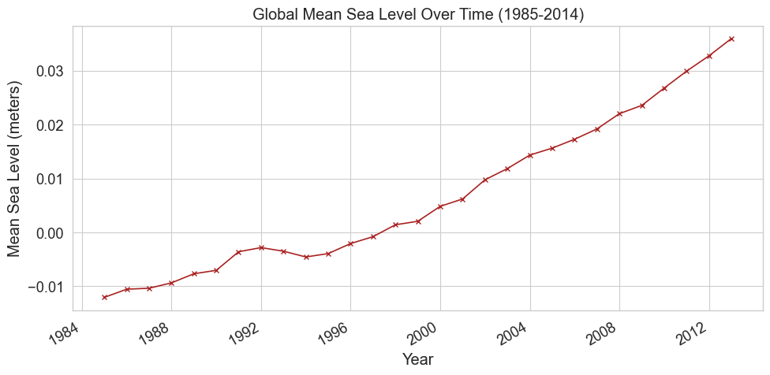
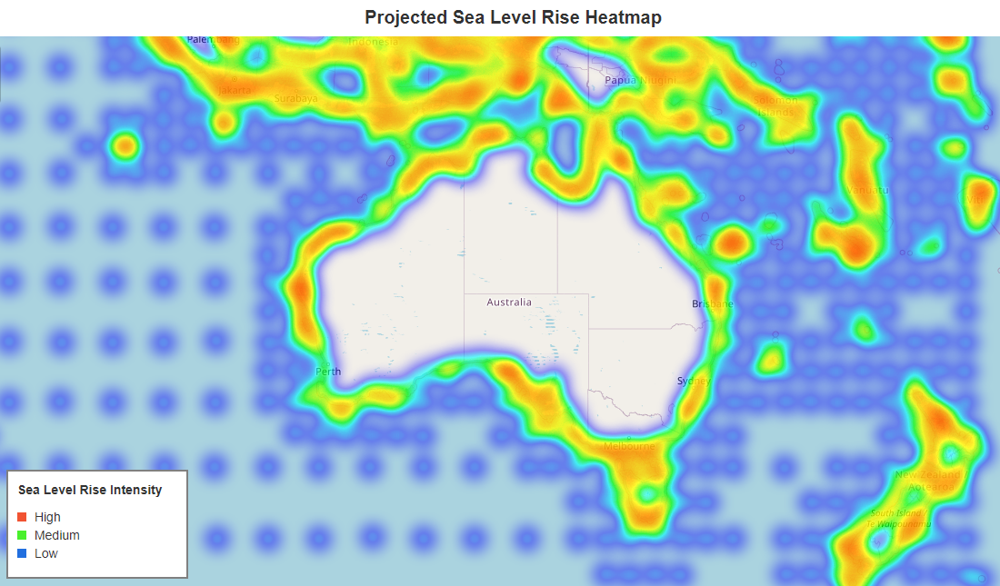
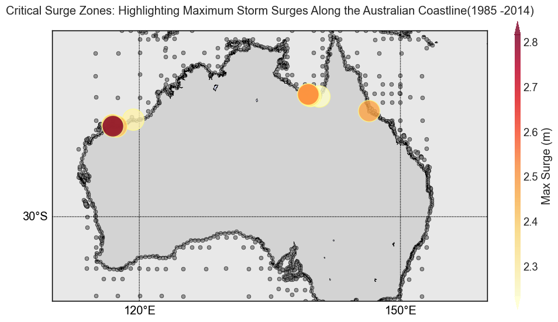
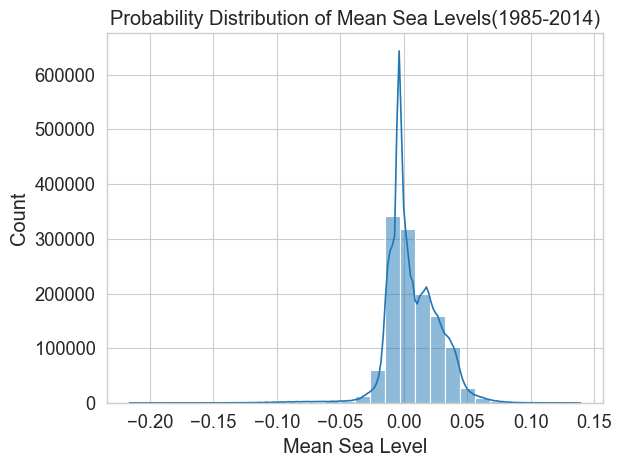
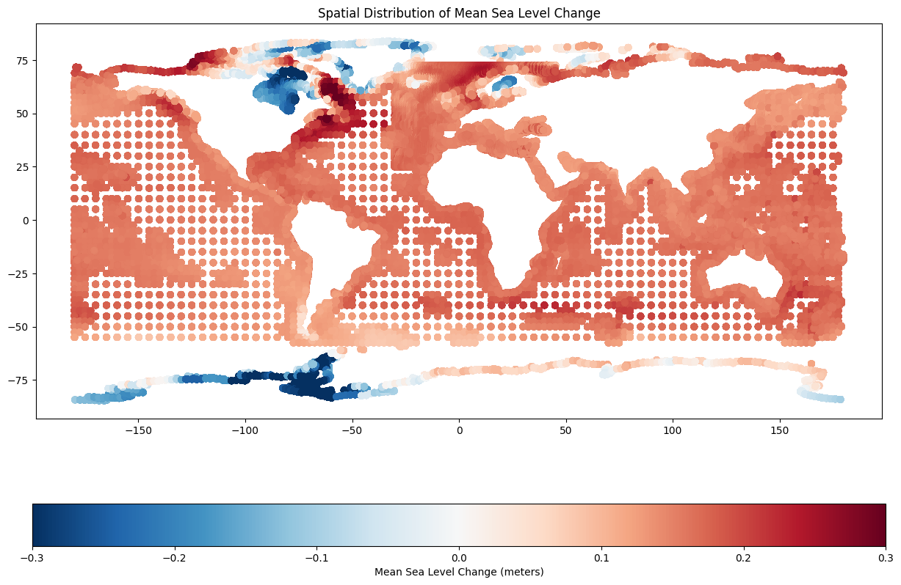
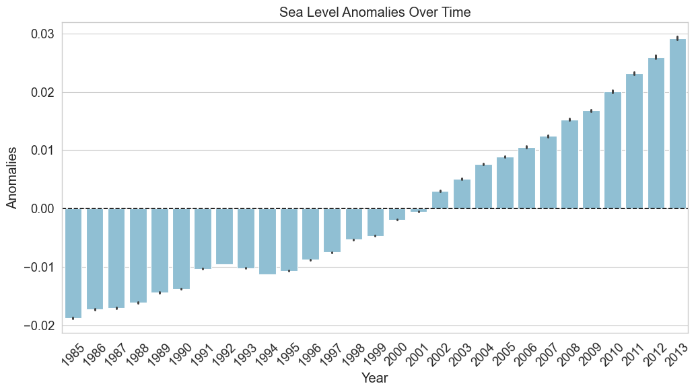
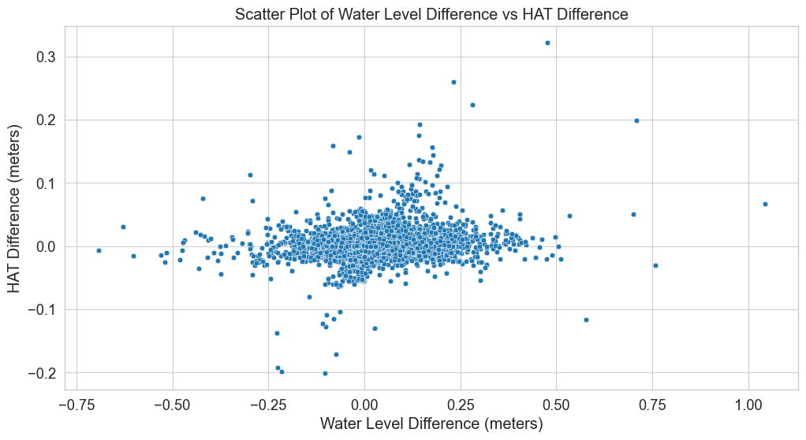

<!DOCTYPE html>
<html lang="en">
<head>
    <meta charset="UTF-8">
    <title>Rising Tides: Visualization Project Report</title>
    
</head>
<body>
    

        <!-- Replace 'path_to_image.jpg' with the actual path to your image -->
        
        <h1>A Comprehensive Analysis of Global Sea Level Projections and Coastal Impacts</h1>
        <h2>Visualization Project Report</h2>
        
<strong>Huining Huang</strong> 
        <strong>110412586</strong>

    

    

</body>
</html>

---

#### Analytical Dashboard for Sea Level Rise: 
**Temporal Trends and Spatial Projections**

| Global Mean Sea Level Over Time (1985-2014) | Global Mean Sea Level Over Time (2021-2050) |
|:-----------------------------------:|:----------------------------------:|
|   |  |

 
| Projected Sea Level Rise Heatmap | Projected Mean Water Level |
|:-------------------------------:|:------------------------------:|
|  |  |

| 10 Most Significant Storm Surge Events (1985-2014, Australia) | Change in Highest Astronomical Tide|
|:--------------------------------:|:-------------------------------:|
| |  |

| Distribution of Mean Sea Levels (1985-2014) | Distribution of Mean Sea Levels (2021-2050) |
|:--------------------------------:|:-------------------------------:|
|  |  |

\pagebreak

---

### Introduction

The urgency of understanding sea level rise in the context of escalating climate change is pivotal for effective coastal management. The Sea Level Rise Monitoring Visualization project utilizes advanced scientific research to predict and illustrate maritime changes with precision.

Research led by Taherkhani et al. (2020) underscores the substantial impact of marginal sea level increases, indicating that a rise of 1–10 cm could notably increase flood frequencies in numerous regions. This trend is expected to worsen, with projections suggesting a transformation of 50-year flood levels into more frequent events by 2050, escalating to nearly daily occurrences by 2100. These projections highlight the critical need for refined monitoring and visualization methods to facilitate adaptive strategies.

Key facets of Sea-Level Monitoring and Ocean Tide Analysis include:

1. **Climate Change Analysis:** Assessing climate change impacts on coastal zones and tracking sea level trends.
2. **Coastal Management:** Utilizing accurate sea level data for infrastructure planning, erosion control, and storm surge prediction.
3. **Tidal Energy Research:** Supporting tidal energy initiatives through ocean tide analysis (Wang et al., 2022).
4. **Navigation and Shipping:** Enhancing maritime safety and efficiency through detailed sea level and tide information.
5. **Disaster Management:** Strengthening early warning systems for coastal flooding and tsunamis through continuous monitoring.

This project aims to integrate these research insights, presenting a data-rich narrative that bridges current and future flood regimes and supports the development of coastal resilience measures. It underscores the significance of scientific innovation in responding to climate change challenges.

Furthermore, the recent resettlement agreement between Australia and Tuvalu, addressing climate refugee relocation, emphasizes the importance of such projects. This pact, a response to environmental displacement risks, highlights the need for informed international and domestic policies, underlining the role of data-driven projects in shaping responses to climate-induced migration challenges.

---

### Temporal Analysis of Sea Level Changes Visualization

The dataset from Copernicus Climate Change Service indeed provides time series of global sea level related variables from 1950 to 2050, based on hydrodynamic modeling with the Deltares Global Tide and Surge Model (GTSM) and climate forcing from the ERA5 reanalysis and CMIP6 high-resolution climate models. The annual mean sea level data provided are relative to the 1986-2005 reference period, considering factors like thermal expansion, changes in ocean circulation, ice sheet contributions, and glacio-isostatic adjustment.

The different scales in the historical and future datasets with the data's scale reflect the acceleration in mean sea level changes, which is consistent with the high-emissions scenario SSP5-8.5 used for the future period simulations. All comparison between the two sets of data takes into account this difference in scale and the underlying assumptions of the climate projections. The metadata and documentation provided with the dataset are critical for understanding these aspects and should always be consulted for accurate data interpretation.

1. **Historical Mean Sea Level (Historical Plot)**: This plot shows relatively minor variations in mean sea level, with most changes within a ±0.02-meter range. The predominance of green suggests that most historical changes have been relatively stable and minimal.

**Figure 1:** Historical Mean Sea Level (1985-2014).

2. **Future Mean Sea Level (Future Plot)**: A much broader range of variation is visible here, with values spanning from -0.3 to +0.3 meters. The use of an orange-yellow palette indicates more significant increases in mean sea level in the future, consistent with predictions of accelerated sea level rise due to climate change.

**Figure 2:** Future Mean Sea Level (2021-2050).

3. **Mean Sea Level Change (Difference Plot)**: This plot highlights the areas where the most significant changes are expected to occur. The shift towards the red end of the spectrum indicates a general trend of rising sea levels, with some areas experiencing a more pronounced increase, which could be due to factors like thermal expansion and ice melt contributing to sea level rise under the high-emission scenario SSP5-8.5.

**Figure 3:** Mean Sea Level Change (2021-2050 vs. 1985-2014)

The difference in scales between the historical and future datasets is indicative of the acceleration in sea level changes projected for the future, which aligns with the current understanding of climate change impacts under high-emission scenarios. The negative values in the future projections, also becoming more negative, might reflect regional variations, where some areas may experience a relative decrease in sea level due to factors such as land uplift or changes in ocean currents.

In summary, while the historical data shows minimal variability in sea level, future projections suggest a significant increase in mean sea level across many regions, with the difference plot emphasizing the stark contrast between past stability and future volatility in sea levels.

#### Time Series Plots:

 

**Figure 4 & 5:** (**top**)Global Mean Sea Level Over Time (1985-2014)  depicts a gradual rise in levels, signaling the onset of climatic shifts affecting sea levels. Despite a relatively moderate increase during this period, the trend is indicative of the beginning stages of more pronounced changes.**(bottom)** Global Mean Sea Level Over Time (2021-2050) demonstrates a clear, more pronounced upward trajectory in sea levels, aligning with projections of accelerated climate impact due to factors such as ice melt and thermal expansion.

The comparative analysis of these periods reflects a transition from historical stability to a future marked by increased variability and elevated sea levels. The stark contrast in the rate of rise between the two datasets highlights the escalating nature of sea level changes, reinforcing the imperative for enhanced coastal management strategies and climate action to mitigate potential risks.

#### Probability Distributions:

 | 
--- | --- 

**Figure 6 & 7:** Probability Distribution of Mean Sea Levels (1985-2014) and (2021-2050).

The probability distribution for the mean sea levels from 1985-2014 exhibits a tight and pronounced peak, reflecting limited variability and more predictable conditions. In contrast, the distribution from 2021-2050 displays a bimodal nature, suggesting the emergence of two prevalent conditions. This indicates increased variability and a tendency towards higher sea levels, suggesting a shift to more frequent high sea level events in the future.

#### Projected Sea Level Rise Heatmap Analysis

**Figure 8:** Projected Sea Level Rise Heatmap.

This Heatmap provides a visual representation of anticipated sea level rise intensity around Australia and its surrounding regions. The most significant increases are apparent along the coastlines, signaling heightened risks of flooding and erosion. Notably, the heatmap underscores non-uniform patterns of sea level rise, with some areas—possibly influenced by local ocean currents, land subsidence, or other regional factors—showing more substantial elevations than others. This suggests the critical need for localized adaptation strategies. As a strategic tool, the heatmap offers policymakers and urban planners clear indications of regional vulnerabilities, stressing the urgency to address areas with potential for severe sea level increases.

#### Historical Sea Level Anomalies Over Time Analysis

**Figure 9:** Historical Sea Level Anomalies Over Time (1985-2014) with error bars.

This graph displays sea level anomalies from 1985 to 2014. Negative anomalies indicate sea levels below average, while positive values denote higher levels. Over this period, a noticeable trend toward increasing positive anomalies, especially in later years, reflects the global pattern of accelerated sea level rise attributed to climate change. This shift from predominantly negative to positive anomalies signals a significant upward sea level trend. Notably, the magnitude of positive anomalies has been growing towards the end of the period, indicating an accelerating pace of sea level rise. This historical analysis validates models projecting future sea levels, confirming a consistent and potentially intensifying pattern of change.

**Figure 10:** This visual cue helps to immediately draw attention to regions with the most severe historical storm surge incidents. 

Storm surges, which are temporary and localized rises in sea level caused by intense storms, pose significant risks to coastal communities, ecosystems, and infrastructure. The visualization maps the spatial distribution of the most significant storm surge events along the Australian coastline from 1985 to 2014, during the critical wet season months from November to April. The highlighted stations on the map indicate areas that have historically faced the most extreme surges, pinpointing potential hot-spots for future flood mitigation and disaster response planning. Each point represents a monitoring station, with the top ten stations experiencing the highest recorded storm surges emphasized.

---

## Evaluating Sea Level Extremes: Insights from 10-Year Return Period Data

**Return period plots** are a fundamental tool in hydrology and environmental studies, representing the statistical likelihood of flood or high water level events over a specified time frame. In this case, the return period is set at ten years, indicating an average expectation of occurrence once within this duration. The distribution of dots of varying sizes, representing standard deviation, indicates the level of uncertainty or variability in the data. Larger dots denote greater variability, suggesting these regions had less consistent mean water levels.

**Figure 11:** Historical Mean Water Level with a 10-Year Return Period showcases the historical spatial variability of water levels expected to occur once every ten years. Regions exhibiting more intense colors experienced higher mean water levels during such events, pointing to historical susceptibility to high-water incidents. The plot also serves as a historical baseline for mean high water levels, essential for gauging changes and planning for future occurrences.

**Figure 12:** Future Mean Water Level with a 10-Year Return Period contrasts with its historical counterpart by projecting an increase in both the intensity and frequency of mean water level heights under future climate conditions. The enhanced color intensity and larger dots indicate an expected rise in mean water levels and greater variability, reflecting increased uncertainty and the complex interplay of factors influencing future sea levels.

The comparison between the historical and future return period plots tells a story of change and increased risk. Historically stable regions, in terms of mean water levels, are projected to experience greater variability and higher levels in the future. This suggests that the effects of climate change, such as rising sea temperatures and melting ice, are likely to increase the frequency and intensity of high-water events, even at the ten-year return period level.

The juxtaposition of historical stability against future projections of heightened variability and risk underscores the evolving challenge posed by climate change. As such, the data calls for proactive adaptation measures, particularly in areas shown to be at increased risk. The visualizations thus become instrumental for decision-makers, urban planners, and conservationists in prioritizing interventions and designing resilient infrastructures and ecological safeguards.

### Sea Level Change Indicators 

**Box plot analysis for Historical Sea Level Change Indicators**

**Figure 13:** Box plot for Historical Sea Level Change Indicators.

The box plot offers vital insights into the variables essential for understanding and monitoring the historical sea level changes. 

1. **Highest Astronomical Tide (HAT)**: The distribution is skewed towards the higher values, with a median slightly above 0 meters. This suggests that the highest tides are generally expected to be positive with respect to the mean sea level, with some outliers indicating exceptionally high tides.

2. **Lowest Astronomical Tide (LAT)**: The LAT values are distributed around a median that is negative, which is consistent with the definition of LAT as the lowest point of the tidal cycle. The spread of values is symmetric about the median, but the presence of outliers on both ends indicates that there are instances where the LAT can be significantly higher or lower than the typical range.

3. **Tide Range (TR)**: The tide range shows a wide distribution with a median close to 0 meters, reflecting the difference between high and low tides. The presence of outliers, particularly on the higher end, suggests that there can be significant variability in tide ranges, possibly due to geographic differences or storm surge events.

- **Indicators of Extremes**: HAT and LAT are critical for identifying areas most at risk from sea level rise, as they represent the extremes of high and low tides, which could exacerbate coastal flooding.

### Risk Assessments for Extreme Events

**Locations with Significant Change in Highest Astronomical Tide**

This plot presents global changes in the Highest Astronomical Tide (HAT), indicating the highest level that sea water is predicted to reach under astronomical conditions alone. The difference shown is between future projections and historical observations.

**Figure 14:** Areas with Significant Change in Highest Astronomical Tide.

The global perspective on HAT changes underscores that the increase in extreme tides will not be uniformly distributed. Certain 'hotspots' could experience substantial impacts, necessitating tailored local strategies. These changes have direct implications for shipping and fishing industries, as well as for the preservation of coastal habitats.

**Areas with Significant Change in Water Level (10 Year Return Period)**

The analysis of return period plots reveals that regions once characterized by stable sea levels are now exhibiting significant increases in both average water levels and Highest Astronomical Tide (HAT), reflecting the broader impact of climate change. This upward trend in water levels, discernible on a global scale with some areas also showing potential declines, accentuates the need for enhanced coastal defense mechanisms and adaptive strategies. The visualizations provided serve as a crucial tool for understanding the extensive influence of climatic shifts on sea levels and emphasize the need for international cooperation in devising and implementing comprehensive response strategies.

**Figure 15:** Areas with Significant Change in Water Level.

**Zooming into Australia (10 Year Return Period)**

This plot focuses on changes in water levels along the Australian coastline. It shows the differences in mean water levels with a return period of 10 years, comparing future projections against a historical baseline. The intensity of the color gradient indicates the magnitude of change, with reds showing an increase and blues a decrease.

**Figure 16:** Areas with Significant Change in Water Level (Australia).

Zooming into the Australian coastline, the data illustrates that the majority of the region is expected to face significant sea level increases. This projection suggests that Australia may see exacerbated coastal flooding and erosion, threatening infrastructure and ecosystems. The larger standard deviations indicate higher uncertainty in some coastal segments, underlining the need for robust, flexible planning to accommodate future contingencies.

**Water Level Difference vs. HAT Difference**

**Figure 17:** Water Level Difference vs. HAT Difference.

The scatter plot examining the relationship between water level differences and Highest Astronomical Tide (HAT) differences reveals several key points. Primarily, the data cluster around the center suggests minor differences for most observations, with a noticeable spread indicating larger water level differences in some areas. The lack of a clear linear pattern suggests a complex relationship between average water level changes and extreme tidal events, rather than a straightforward correlation. Outliers, particularly on the water level difference axis, hint at locations with markedly different conditions, pointing to areas that may require closer investigation. For coastal management, this indicates that while extreme tidal events must be considered, there is a broader variability in general water level changes that poses a diverse range of challenges. This scatter plot serves as a critical analytical tool for policymakers, emphasizing the need to account for both average and extreme sea level changes in strategic planning.

---

### Summary and Conclusion

Climate change is amplifying the risks associated with rising sea levels, posing imminent challenges to coastal management and necessitating the adoption of sophisticated monitoring techniques. This report synthesizes insights from advanced scientific research and robust datasets to provide a comprehensive narrative on the escalating phenomena of sea level rise.

Utilizing pivotal datasets from the Copernicus Climate Change Service (C3S) Climate Data Store (CDS), this project has embarked on a mission to chart historical and future sea level trajectories, offering granular insights into tidal ranges, storm surges, and mean sea levels. Through a diverse array of visualizations, including probability distributions, time series plots, and return period projections, the report elucidates the nuanced dynamics of sea level patterns over time, revealing a clear trend of increasing levels and variability. The spatial analysis further dissects the variance in sea level rise, identifying hot-spots that warrant urgent attention for their heightened vulnerability. The Australian coastline, in particular, is spotlighted for significant projected increases in sea level, necessitating immediate and forward-looking coastal management plans.

The report employs a detailed return period analysis to quantify the increasing frequency and intensity of high-water events expected to occur once every ten years. This analysis is instrumental in identifying regions with heightened risk and variability in sea levels, offering critical insights for future-proofing coastal infrastructures and ecosystems against the escalating threats of flooding and erosion. The evidence of sea level rise and the insights from return period analysis illustrated in this report necessitate a series of strategic responses. Enhancing coastal resilience through both natural and artificial means is critical, especially in high-risk areas identified by the projections. Adaptive measures for existing infrastructure and future developments are essential to withstand increased sea levels. The development and implementation of robust climate policies can support sustainable coastal management practices and provide necessary resources for affected communities. Increased public awareness and education about sea level rise implications and the importance of return period analyses are vital for community preparedness. Lastly, international collaboration is imperative, as sea level rise is a global challenge that requires a unified approach to climate change adaptation and mitigation.

The evidence calls for strategic responses: enhancing coastal resilience, adapting infrastructure, climate policies, public awareness, and global cooperation. This report emphasizes the urgency and necessity for action in the face of rising sea levels, underscored by return period analysis.

---

\pagebreak

### References

1. Doherty, B. (2023, November 10). Tuvalu residency and security treaty: what is it and why is Australia doing it? *The Guardian*. Retrieved from https://www.theguardian.com/australia-news/2023/nov/10/tuvalu-residency-and-security-treaty-what-is-it-and-why-is-australia-doing-it

2. Taherkhani, M., Vitousek, S., Barnard, P. L., et al. (2020). Sea-level rise exponentially increases coastal flood frequency. *Scientific Reports, 10*(1), 6466. https://doi.org/10.1038/s41598-020-62188-4

3. Wang, N., et al. (2022). Sea-Level Monitoring and Ocean Tide Analysis Based on Multipath Reflectometry Using Received Strength Indicator Data From Multi-GNSS Signals. *IEEE Transactions on Geoscience and Remote Sensing, 60*, 1-13. https://doi.org/10.1109/TGRS.2022.3219074

4. Muis, S., Irazoqui Apecechea, M., Álvarez, J. A., Verlaan, M., Yan, K., Dullaart, J., Aerts, J., Duong, T., Ranasinghe, R., le Bars, D., Haarsma, R., & Roberts, M. (2022). Global sea level change indicators from 1950 to 2050 derived from reanalysis and high resolution CMIP6 climate projections. *Copernicus Climate Change Service (C3S) Climate Data Store (CDS)*. https://doi.org/10.24381/cds.6edf04e0

5. Muis, S., Irazoqui Apecechea, M., Álvarez, J. A., Verlaan, M., Yan, K., Dullaart, J., Aerts, J., Duong, T., Ranasinghe, R., le Bars, D., Haarsma, R., & Roberts, M. (2022). Global sea level change time series from 1950 to 2050 derived from reanalysis and high resolution CMIP6 climate projections. *Copernicus Climate Change Service (C3S) Climate Data Store (CDS)*. https://doi.org/10.24381/cds.a6d42d60

\pagebreak

---

### Appendix 1: Data Sources

### Data Sources

#### Overview

The Sea Level Rise Monitoring Visualization project integrates two critical datasets from the Copernicus Climate Change Service (C3S) Climate Data Store (CDS). These datasets, encompassing global sea level indicators and time series, are instrumental for assessing sea level changes from 1950 to 2050 under various climate scenarios.

#### Dataset Descriptions

1. **Global Sea Level Change Indicators (1950-2050)**
   - **Reference:** Sanne Muis, Maialen Irazoqui Apecechea, José Antonio Álvarez, Martin Verlaan, Kun Yan, Job Dullaart, Jeroen Aerts, Trang Duong, Rosh Ranasinghe, Dewi le Bars, Rein Haarsma, Malcolm Roberts, (2022): Global sea level change indicators from 1950 to 2050 derived from reanalysis and high resolution CMIP6 climate projections. Copernicus Climate Change Service (C3S) Climate Data Store (CDS). DOI: 10.24381/cds.6edf04e0
   - **Key Elements:** Extreme and probability indicators for water levels, covering historical, present, and future periods based on CMIP6 high-emission scenarios.
   - **Resolution and Coverage:** Variable grid steps globally, focusing on coastal and ocean areas.
   - **Variables:** Include astronomical tides, mean sea level, tidal range, and surge levels.
   - **Data Format:** NetCDF-4, following CF-1.6 and ACDD-1.3 conventions.

2. **Global Sea Level Change Time Series (1950-2050)**
   - **Reference:** Sanne Muis, Maialen Irazoqui Apecechea, José Antonio Álvarez, Martin Verlaan, Kun Yan, Job Dullaart, Jeroen Aerts, Trang Duong, Rosh Ranasinghe, Dewi le Bars, Rein Haarsma, Malcolm Roberts, (2022): Global sea level change time series from 1950 to 2050 derived from reanalysis and high resolution CMIP6 climate projections. Copernicus Climate Change Service (C3S) Climate Data Store (CDS). DOI: 10.24381/cds.a6d42d60
   - **Features:** Hydrodynamic modeling data for tides, storm surges, and sea level rise.
   - **Methodology:** Utilizes Deltares Global Tide and Surge Model (GTSM) version 3.0, informed by ERA5 reanalysis and CMIP6 GCMs.
   - **Variables:** Tidal elevation, storm surge residual, mean sea level, and total water level.
   - **Temporal Resolution:** From 10-minute intervals to annual, with historical and future projections.

#### Integration and Application

These datasets, with their extensive spatiotemporal scope and granular variables, underpin the project's ability to analyze sea level dynamics comprehensively. They enable a nuanced understanding of coastal responses to climate change, informing forecasting and resilience planning.

**Table 1: Key Variables from Datasets**

| Variable Name | Units | Source | Description |
|---------------|-------|--------|-------------|
| Annual Mean of Highest/Lowest High Water | m | Source 1 | Average extreme tides |
| Highest/Lowest Astronomical Tide | m | Source 1 | Extremes of predicted tides |
| Mean Sea Level | m | Source 1 & 2 | Average over 30 years |
| Surge Level | m | Source 1 | Difference between tide-only and total water levels |
| Tidal Range | m | Source 1 | Difference between high and low water levels |
| Total Water Level | m | Source 1 & 2 | Combination of tides, surges, and interactions |
| Storm Surge Residual | m | Source 2 | Difference between total water level and tidal elevation |
| Tidal Elevation | m | Source 2 | Pure tide from celestial forces |

